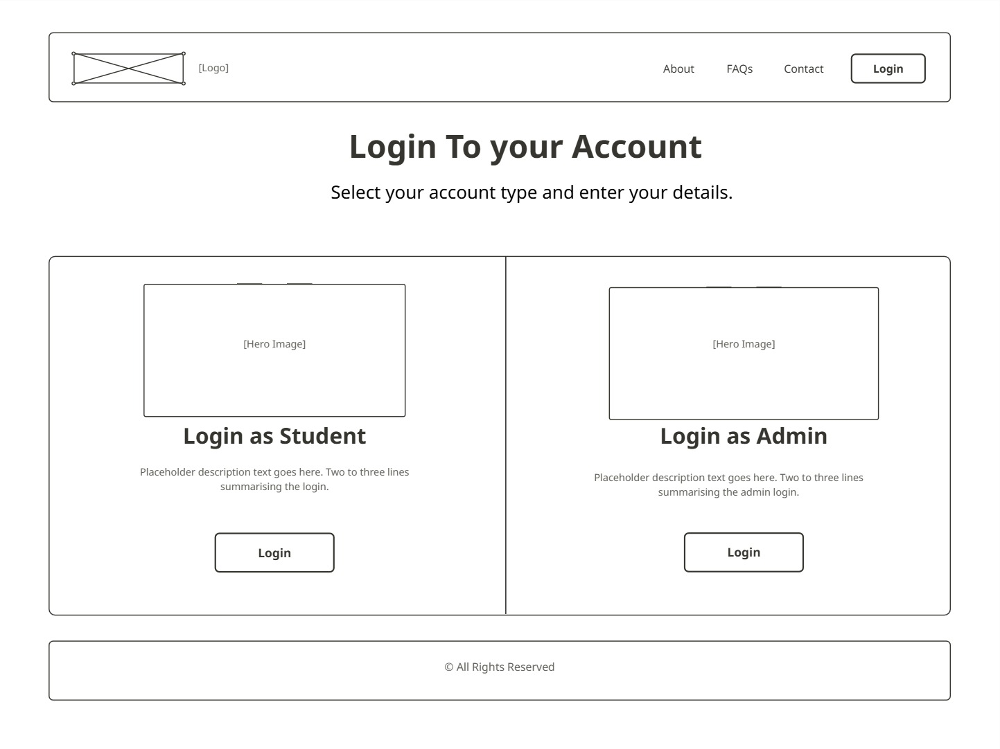
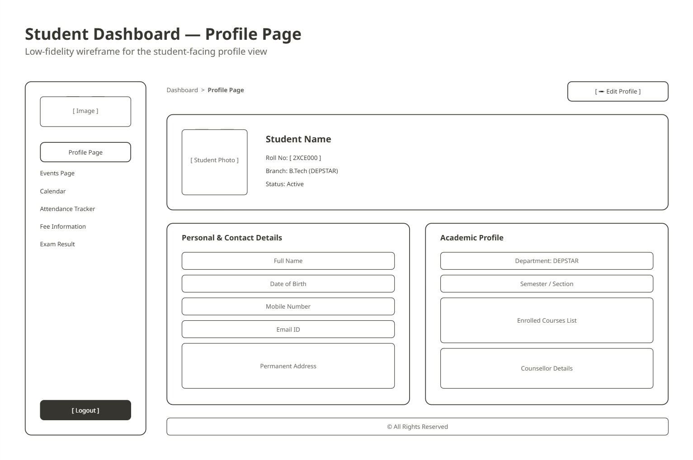
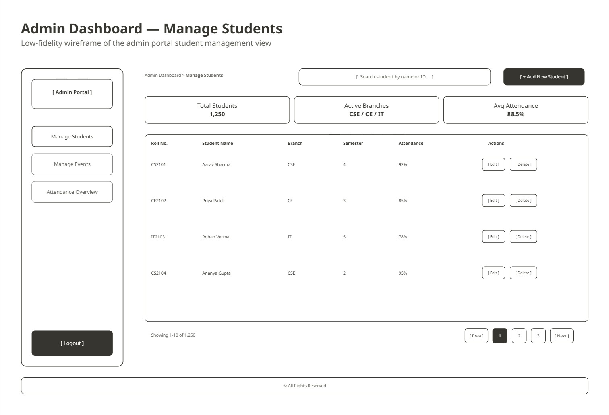

<div align="center">

# 🎓 Student Hub Portal

**A front-end student management portal with separate Student and Admin experiences.**


*Semester 3 · Web Development Frameworks*

</div>

---

## 📖 Table of Contents

- [Overview](#-overview)
- [Features](#-features)
- [Tech Stack](#-tech-stack)
- [Wireframes](#-wireframes)
- [Folder Structure](#-folder-structure)
- [Getting Started](#-getting-started)
- [Form Validation Rules](#-form-validation-rules)
- [How Data & Sessions Work](#-how-data--sessions-work)
- [Roadmap](#-roadmap)
- [Contributing](#-contributing)
- [Author](#-author)
- [License](#-license)

---

## 🔎 Overview

**Student Hub Portal** is a multi-page web application built as a Semester 3 *Web Development Frameworks* project. It gives a campus a single place for public information (home, about, FAQs, contact) and role-based areas for **students** and **administrators**, each with their own registration, login and dashboard.

The portal is designed around Charusat University conventions (college e-mail domains and enrollment ID formats) and is built entirely with **vanilla HTML, CSS and JavaScript**, with no build step or external dependencies.

---

## ✨ Features

### Public site
- **Home page** with role-based registration cards and a live **Campus Weather** widget (temperature, wind speed, humidity and a running clock via the [Open-Meteo](https://open-meteo.com/) API).
- **About**, **FAQs** (accordion-style expand/collapse) and **Contact** pages.
- **Login gateway** that routes users to the Student or Admin login.

### Student area
| Module | Description |
| --- | --- |
| **Registration** | Full client-side validated form (name, enrollment ID, DOB, gender, e-mail, phone, address, course, year). |
| **Login** | Stores the student's session details in the browser and opens the dashboard. |
| **Dashboard** | Profile summary with a responsive sidebar menu. |
| **Profile** | Personal and academic details. |
| **Events** | Directory of upcoming campus events with date, time and venue. |
| **Calendar** | Month view with a list of important dates. |
| **Attendance Tracker** | Overall percentage, classes attended and a subject-wise breakdown with status labels. |
| **Fee Information** | Total, paid and pending amounts with a fee-type table. |
| **Exam Results** | Subject-wise marks, grades and pass/fail result. |

### Admin area
- **Registration** with Admin ID format check, role and department selection, proof-of-affiliation upload and a code-of-conduct agreement.
- **Login** and an **Admin Dashboard** that shows the signed-in administrator's name, campus role, official e-mail and department.

### Quality touches
- Strict, user-friendly validation with focused error messages.
- Responsive dashboard navigation (collapsible ☰ menu on small screens).

---

## 🛠 Tech Stack

| Layer | Technology |
| --- | --- |
| Markup | HTML5 |
| Styling | CSS3 (per-page stylesheets, Flexbox/Grid layouts, media queries) |
| Behaviour | Vanilla JavaScript |
| Browser storage | `localStorage` for session details |
| External API | Open-Meteo (weather widget) |
| Tooling | VS Code (Chrome launch configuration included) |

---

## 🖼 Wireframes

Design wireframes and the full site map live in the [`Wireframes/`](Wireframes) folder. See [`Wireframes/Sitemap.md`](Wireframes/Sitemap.md) for the complete page hierarchy.

<table>
  <tr>
    <td align="center"><br><sub>Home Page</sub></td>
    <td align="center"><br><sub>Login Page</sub></td>
  </tr>
  <tr>
    <td align="center"><br><sub>Student Dashboard</sub></td>
    <td align="center"><br><sub>Admin Dashboard</sub></td>
  </tr>
</table>

---

## 📁 Folder Structure

```text
Student-Hub-Portal/
│
├── index.html                  # Home page (public)
├── index.css
├── index.js                    # Weather widget + live clock
├── about.html                  # About page
├── about.css
├── contact.html                # Contact page
├── contact.css
├── faqs.html                   # FAQ page
├── faqs.css
├── faqs.js                     # Accordion behaviour
├── Login.html                  # Login gateway (Student / Admin)
├── login.css
│
├── Student/                    # Student-facing pages
│   ├── regis_stud.html         # Student registration
│   ├── regis_stud.css
│   ├── regis_stud.js           # Registration form validation
│   ├── Stud_login.html         # Student login
│   ├── Stud_login.css
│   ├── Stud_login.js           # Saves student session to localStorage
│   ├── test_validations.js     # Node.js validation tests
│   │
│   ├── DashBoard/
│   │   ├── student_dashboard.html
│   │   ├── student_dashboard.css
│   │   └── menu.js             # Sidebar toggle + logged-in user details
│   ├── Profile/
│   │   ├── profile.html
│   │   └── profile.css
│   ├── Event/
│   │   ├── event.html
│   │   └── event.css
│   ├── Calender/
│   │   ├── calendar.html
│   │   └── calendar.css
│   ├── Attendance/
│   │   ├── attendance.html
│   │   └── attendance.css
│   ├── Fee/
│   │   ├── fee.html
│   │   └── fee.css
│   └── Exam_Result/
│       └── exam_result.html
│
├── Admin/                      # Admin-facing pages
│   ├── regis_admin.html        # Admin registration
│   ├── regis_admin.css
│   ├── regis_admin.js          # Registration form validation
│   ├── Admin_login.html        # Admin login
│   ├── Admin_login.css
│   ├── Admin_login.js          # Saves admin session to localStorage
│   └── DashBoard/
│       └── admin_dashboard.html
│
├── Fonts/                      # Font files (.ttf)
│   ├── BitcountPropSingle-Regular.ttf
│   ├── BlackOpsOne-Regular.ttf
│   └── Bungee-Regular.ttf
│
├── Images/                     # Logos, banners and illustrations
│
├── Wireframes/                 # UI wireframes and site map
│   ├── Sitemap.md
│   ├── Home Page.png
│   ├── Login_page.jpg
│   ├── Student_Login.png
│   ├── Admin_Login.png
│   ├── stud_dashboard.jpg
│   ├── admin_dashboard.jpg
│   ├── about.jpg
│   ├── contact.jpg
│   └── faqs.jpg
│
├── .vscode/
│   └── launch.json             # Chrome debug configuration
│
└── README.md
```

---

## 🚀 Getting Started

### Prerequisites

- A modern web browser (Chrome, Edge, Firefox or Safari)
- *Optional:* [VS Code](https://code.visualstudio.com/) with the **Live Server** extension

### Installation

```bash
# 1. Clone the repository
git clone https://github.com/Gyan080/Student-Hub-Portal.git

# 2. Move into the project folder
cd Student-Hub-Portal
```

### Run the project

The portal is fully static, so no build or install step is required.

**Option A: open directly**
Double-click `index.html`, or open it from your browser with *File → Open File*.

**Option B: local development server (recommended)**

```bash
# Using Python
python -m http.server 5500

# or using Node.js
npx serve .
```

Then visit **http://localhost:5500** in your browser. With VS Code, you can instead right-click `index.html` and choose **Open with Live Server**.

### Run the validation tests

```bash
node Student/test_validations.js
```

Expected output ends with `ALL TESTS PASSED SUCCESSFULLY!`

---

## ✅ Form Validation Rules

Registration forms validate input in the browser before showing a success message.

| Field | Rule | Example |
| --- | --- | --- |
| First / Middle / Last name | Letters only, 2–50 characters | `Gyan` |
| Student enrollment ID | 2 digits + 3 letters + 3 digits | `25dcs080` |
| Admin ID | `ADM` + exactly 5 digits (case-insensitive) | `ADM12345` |
| E-mail | Must end in `@charusat.edu.in` or `@charusat.ac.in` | `name@charusat.edu.in` |
| Phone | 10 digits, starting with 6, 7, 8 or 9 | `9876543210` |
| Date of birth | Students must be **15+**, admins **18+** | — |
| Address | 10–200 characters | — |
| Other required fields | Gender, course/department, year/role must be selected | — |
| Admin extras | Proof of affiliation uploaded and guidelines accepted | — |

---

## 🔐 How Data & Sessions Work

This project is a **front-end prototype**. There is no server or database:

- Login forms save the entered details (name, ID, e-mail, department/role) to the browser's `localStorage` under the keys `studentUser` and `adminUser`. Dashboards read these values to greet the signed-in user.
- Registration forms validate input and display a confirmation, but they do **not** persist accounts anywhere.
- Attendance, fee, event, calendar and exam-result figures are **static sample data** written directly in the HTML.

> ⚠️ Because there is no real authentication, this project is intended for learning and demonstration only. Do not enter real credentials or sensitive personal data.

---

## 🗺 Roadmap

- [ ] Update relative links and asset paths for the new `Student/` and `Admin/` folder layout
- [ ] Add a real backend (Node.js/Express or similar) with a database for accounts and records
- [ ] Implement secure authentication with password hashing and role-based route protection
- [ ] Replace static attendance, fee, event and result data with dynamic content
- [ ] Build out the Admin modules from the site map: Manage Events, Manage Students, Attendance Overview
- [ ] Add the Feedback and 404 pages from the site map
- [ ] Improve accessibility (labels, ARIA attributes, contrast) and mobile responsiveness
- [ ] Deploy with GitHub Pages

---

## 🤝 Contributing

Suggestions and improvements are welcome.

1. Fork the repository
2. Create a feature branch: `git checkout -b feature/your-feature`
3. Commit your changes: `git commit -m "Add your feature"`
4. Push to the branch: `git push origin feature/your-feature`
5. Open a Pull Request

Please keep the existing folder conventions and run `node Student/test_validations.js` before submitting changes to validation logic.

---

## 👤 Author

GitHub: [@Gyan080](https://github.com/Gyan080)

Project repository: [github.com/Gyan080/Student-Hub-Portal](https://github.com/Gyan080/Student-Hub-Portal)

---

## 📄 License

This project was created for academic purposes. No license file is currently included, so all rights are reserved by the author unless one is added.

---

<div align="center">

⭐ If you found this project useful, consider giving it a star.

</div>
